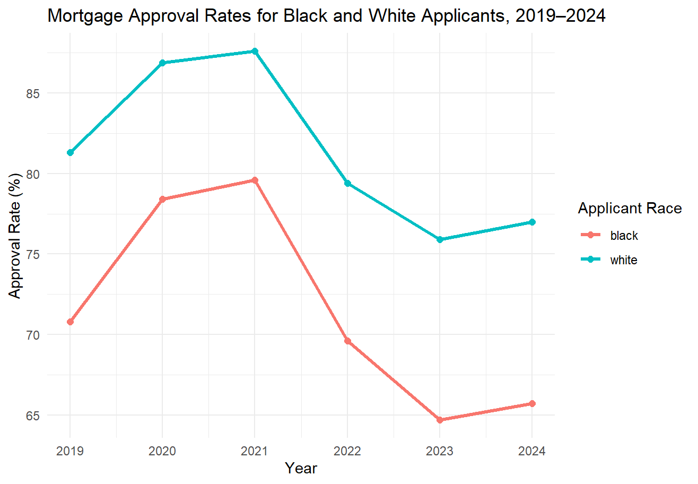
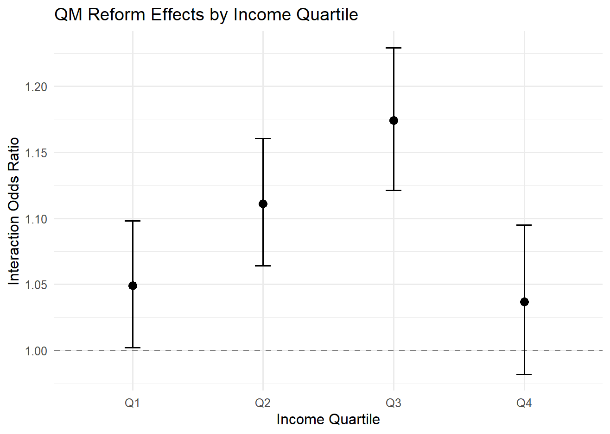

# Mortgage Lending Policy Impact Analysis: Racial Disparities & the 2021 Qualified Mortgage Reform
Econometric analysis of 4.2 million California mortgage applications using logistic regression and interaction models to evaluate racial disparities in lending and the impact of the 2021 Qualified Mortgage reform.

## Overview
This project examines racial disparities in mortgage approval outcomes and evaluates whether those disparities changed following the 2021 Qualified Mortgage (QM) reform. Using California mortgage application data from the Home Mortgage Disclosure Act (HMDA) for 2019–2024, I analyzed approval patterns for Black and White applicants before and after the policy change.

The analysis combines descriptive approval-rate comparisons with logistic regression models that control for observable borrower and loan characteristics, including applicant income, loan amount, property value, and debt-to-income ratio. A pooled interaction model was then used to estimate whether the relative approval gap changed during the post-reform period.

## Research Questions
The analysis addresses three primary questions:

1. Do disparities in mortgage approval outcomes between Black and White applicants persist after accounting for observable borrower and loan characteristics?
2. Did the racial approval gap change following the 2021 Qualified Mortgage reform?
3. Did the estimated impact of the reform differ across borrower income levels?

## Dataset
The analysis uses 2019–2024 mortgage application data from the Home Mortgage Disclosure Act (HMDA), restricted to California and focused on Black and White applicants.

The final analytical sample contains approximately **4.2 million mortgage applications** and includes information on mortgage approval outcomes, applicant characteristics, and loan and property characteristics used in the regression analysis.

Key variables include:

- **Mortgage approval outcome**
- **Applicant race**
- **Applicant income**
- **Loan amount**
- **Property value**
- **Debt-to-income ratio**
- **Application year**
- **Pre-/post-QM reform period**

## Analytical Approach
### 1. Descriptive Analysis — Mortgage Approval Rates
I first compared annual mortgage approval rates for Black and White applicants from 2019 through 2024 to examine how the raw racial approval gap evolved before and after the Qualified Mortgage reform.

Across all six years, White applicants had higher approval rates than Black applicants. The unadjusted approval gap ranged from approximately **8 to 11 percentage points**, indicating persistent differences in mortgage approval outcomes throughout the study period.

*Annual mortgage approval rates for Black and White applicants in the California HMDA analytical sample, 2019–2024.*

| Year | White Approval Rate (%) | Black Approval Rate (%) | Gap (pp) |
| ---- | ----------------------: | ----------------------: | -------: |
| 2019 | 81.3 | 70.7 | 10.5 |
| 2020 | 86.9 | 78.4 | 8.5 |
| 2021 | 87.6 | 79.6 | 8.0 |
| 2022 | 79.4 | 69.6 | 9.8 |
| 2023 | 75.9 | 64.7 | 11.2 |
| 2024 | 77.0 | 65.7 | 11.3 |

Because these raw differences do not account for differences in borrower financial characteristics, descriptive approval rates alone cannot determine whether disparities persist among otherwise observationally similar applicants. I therefore used logistic regression to estimate approval disparities while controlling for observable borrower and loan characteristics.

### 2. Logistic Regression — Adjusted Racial Approval Disparities
To examine whether racial disparities persisted after accounting for observable differences in borrower and loan characteristics, I estimated separate logistic regression models for each year from 2019 through 2024.

The dependent variable indicates whether a mortgage application was approved, while the primary explanatory variable identifies Black applicants, with White applicants serving as the reference group. Each model controls for:

- **Applicant income**
- **Loan amount**
- **Property value**
- **Debt-to-income ratio**

Regression coefficients were converted to odds ratios for interpretation. An odds ratio below 1 indicates lower approval odds for Black applicants relative to otherwise observationally similar White applicants.

| Year | Black Applicant Odds Ratio |
| ---- | -------------------------: |
| 2019 | 0.621 |
| 2020 | 0.618 |
| 2021 | 0.626 |
| 2022 | 0.665 |
| 2023 | 0.635 |
| 2024 | 0.646 |

Across all six years, Black applicants had significantly lower estimated odds of mortgage approval than White applicants after controlling for observable borrower and underwriting characteristics. The estimated odds ratios ranged from **0.618 to 0.665**, corresponding to approximately **33% to 38% lower approval odds**.

Although the annual estimates suggest that the disparity may have narrowed somewhat after 2021, comparing separate yearly models does not provide a formal test of whether the Qualified Mortgage reform changed the racial approval gap. I therefore estimated a pooled interaction model to directly evaluate the policy change.

### 3. Qualified Mortgage Reform — Pooled Interaction Model
To formally evaluate whether the racial approval gap changed following the 2021 Qualified Mortgage reform, I estimated a pooled logistic regression model using mortgage applications from 2019–2024.

The model includes an interaction between **Black applicant status** and the **post-reform period (2022–2024)**:

**Black × Post-QM**

This interaction tests whether the approval odds of Black applicants changed relative to White applicants after the reform, while controlling for applicant income, loan amount, property value, and debt-to-income ratio.

| Variable | Odds Ratio |
| -------- | ---------: |
| Black | 0.615 |
| Post-QM | 0.824 |
| **Black × Post-QM** | **1.083** |

The interaction term is statistically significant (**p < 0.001**), with an estimated odds ratio of **1.083**. This indicates that Black applicants experienced approximately **8.3% higher relative approval odds in the post-reform period compared with the pre-reform period**.

Importantly, this does not mean that Black applicants had higher approval odds than White applicants after the reform. Rather, the results indicate that the existing racial approval disparity became modestly smaller.

Importantly, this does not mean that Black applicants had higher approval odds than White applicants after the reform. Rather, the results indicate that the existing racial approval disparity became modestly smaller.

Overall, the analysis provides evidence of a **modest narrowing of the adjusted racial approval gap** following the 2021 Qualified Mortgage reform, while substantial disparities remained.

### 4. Income Heterogeneity Analysis
To examine whether the estimated post-reform change in racial approval disparities differed across borrower income levels, I re-estimated the pooled interaction model separately for each income quartile.

Income quartiles were defined using the applicant income distribution in the pooled 2019–2024 sample. For each group, the **Black × Post-QM** interaction measures how the relative approval odds of Black applicants changed following the reform.

| Income Quartile | Income Range | Black × Post-QM Odds Ratio | p-value |
| --------------- | :----------: | -------------------------: | ------: |
| Q1 | $10,000–$80,000 | 1.049 | 0.040 |
| Q2 | $80,000–$120,000 | 1.111 | <0.001 |
| Q3 | $120,000–$186,000 | **1.174** | **<0.001** |
| Q4 | Above $186,000 | 1.037 | 0.192 |

*Estimated Black × Post-QM interaction odds ratios by income quartile with 95% confidence intervals. The dashed line at 1.00 represents no estimated change in relative approval odds.*

The estimated narrowing of the racial approval gap was strongest among **Q3 borrowers ($120,000–$186,000)**, where Black applicants experienced approximately **17.4% higher relative post-reform approval odds** compared with the pre-reform period.

The interaction was also positive and statistically significant for Q1 and Q2 borrowers, while the Q4 estimate was smaller and not statistically significant. These results suggest that the estimated post-reform change in racial approval disparities was not uniform across income groups.

## Key Findings
- **Racial disparities persisted throughout the study period.** White applicants had higher unadjusted mortgage approval rates than Black applicants in every year from 2019–2024, with raw approval gaps ranging from approximately **8 to 11 percentage points**.

- **Disparities remained after controlling for observable borrower and loan characteristics.** Annual logistic regression models estimated Black applicant odds ratios between **0.618 and 0.665**, corresponding to approximately **33% to 38% lower approval odds** relative to otherwise observationally similar White applicants.

- **The adjusted racial approval gap narrowed modestly following the 2021 QM reform.** The pooled **Black × Post-QM** interaction produced an odds ratio of **1.083 (p < 0.001)**, indicating approximately **8.3% higher relative post-reform approval odds** for Black applicants compared with the pre-reform period.

- **The estimated post-reform change varied across income groups.** The strongest interaction was observed among **Q3 borrowers ($120,000–$186,000)**, with an odds ratio of **1.174**, while the estimate for the highest-income quartile was smaller and not statistically significant.

- **Substantial disparities remained despite the estimated narrowing.** The results suggest a modest improvement in relative approval outcomes following the reform, but Black applicants continued to experience lower adjusted approval odds than White applicants.

## Tools & Methods
**Language:** R

**Libraries:** tidyverse, data.table, ggplot2

**Methods:** Logistic Regression, Interaction Modeling, Odds Ratio Interpretation, Heterogeneity Analysis, Descriptive Statistics, Data Cleaning & Transformation

**Data:** Home Mortgage Disclosure Act (HMDA), 2019–2024 California mortgage applications

## Project Structure
- `README.md` — Project overview, methodology, results, and key findings
- `figures/` — Visualizations of mortgage approval outcomes
- `analysis/` — R scripts used for data preparation, regression modeling, and policy analysis

## Author
**Anne Han**  
M.S. Business Analytics Candidate, UCLA Anderson School of Management  
B.S. Business Economics, University of California, San Diego

